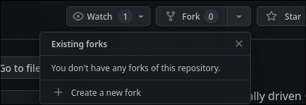
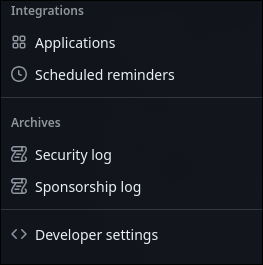
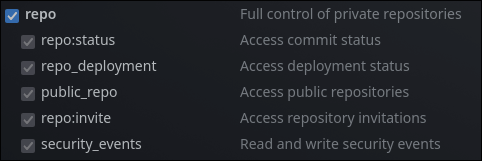
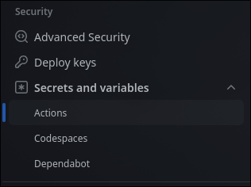
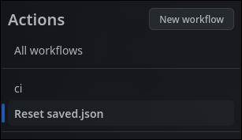
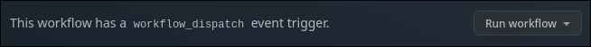

# 🌲 GitForest 🌲

# 🚧 Project is currently under construction

## 🤨 What is it?

GitForest is a dynamic, visually driven GitHub profile enhancement that
turns your contribution history into a forest. The more you code, the
bigger the forest grows. The forest will be periodically reset to prevent
the forest from becoming to large however the data (how many forests you've
filled) will be stored and displayed. GitForest helps you visualize
consistency, progress and growth in a more organic, motivating and fun
way.

### ✨ Features

 - 🌳 **Visual growth:** When you contribute more you see trees grow 
and new elements appear as the ecosystem grows
 - 📈 **Progress tracker:** See how many forests you've filled over time
 - 🛠️ **GitHub integration:** Works directly with your contribution data

### 🚀 Installation

1. Create a fork

2. Go to your profile settings
3. Scroll down and click developer settings

4. Click on personal access tokens and then on token (classic)

5. Click generate new token (for general use)
6. Name it however you like and select repo scope

7. Scroll down and click generate token (make sure to copy it)
8. Go back to the forked repository and go to repository settings
9. Click on secrets and variables then actions

10. In repository secrets edit the API_KEY secret and paste your personal access token
11. Click on variables and edit USERNAME to match your username and year to match the current year
12. Go to repository actions and click on reset saved.json (ci might not show yet)

13. Click run workflow

14. Done! The ci script runs automatically every 10 minutes which is responsible for updating the svg
15. If you want to have it in your profile README go to assets/forest.svg and copy the raw link to it then paste it 
in your README like this

### 🧩 Technologies

- C++
  - rapidjson library
  - pugixml library
  - catch2 framework
- GitHub API
- SVGs (made in figma)

### 📅 Roadmap

- PRIORITY:
- [X] Complete at least 2 Trees or other elements
- [X] Create Background
- [X] Make README
- [X] Test if a library for embedding SVG is working
- [X] Test different inputs
- [X] Integrate GitHub API
- MIGHT TAKE LONGER:
- [ ] Change backgrounds depending on day streaks
- [ ] Add more forest elements
- [ ] Choosing a background color palette